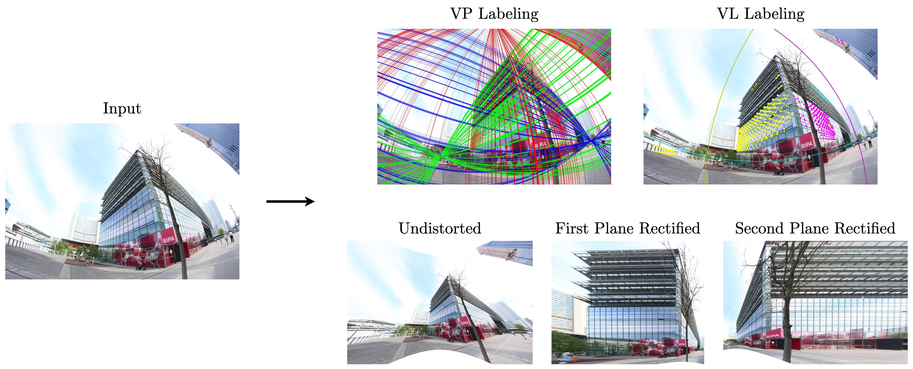

# Minimal Solvers for Single-View Lens-Distorted Camera Auto-Calibration

<div align="center">

[](http://arxiv.org/abs/2011.08988)
[](https://openaccess.thecvf.com/content/WACV2021/html/Lochman_Minimal_Solvers_for_Single-View_Lens-Distorted_Camera_Auto-Calibration_WACV_2021_paper.html)
[](https://ylochman.github.io/sv-autocalib/poster.pdf)
[](https://ylochman.github.io/sv-autocalib/slides.pdf)

This repository contains the MATLAB implementation of the single-view auto-calibration framework.



</div>

### Abstract

This paper proposes minimal solvers that use combinations of imaged translational symmetries and parallel scene lines to jointly estimate lens undistortion with either affine rectification or focal length and absolute orientation. We use constraints provided by orthogonal scene planes to recover the focal length. We show that solvers using feature combinations can recover more accurate calibrations than solvers using only one feature type on scenes that have a balance of lines and texture. We also show that the proposed solvers are complementary and can be used together in a RANSAC-based estimator to improve auto-calibration accuracy. State-of-the-art performance is demonstrated on a standard dataset of lens-distorted urban images.


If you find our work useful or interesting, please consider citing us:
```bibtex
@InProceedings{Lochman-WACV21,
    title     = {Minimal Solvers for Single-View Lens-Distorted Camera Auto-Calibration},
    author    = {Lochman, Yaroslava and Dobosevych, Oles and Hryniv, Rostyslav and Pritts, James},
    booktitle = {Proceedings of the IEEE Winter Conference on Applications of Computer Vision},
    year      = {2021},
}
```
If you use detected translational symmetries please also cite:
```bibtex
@Article{Pritts-PAMI20,
    title     = {Minimal Solvers for Rectifying from Radially-Distorted Conjugate Translations}, 
    author    = {Pritts, James and Kukelova, Zuzana and Larsson, Viktor and Lochman, Yaroslava and Chum, Ond{\v{r}}ej},
    journal   = {IEEE Transactions on Pattern Analysis and Machine Intelligence},
    year      = {2020},
}
```
and
```bibtex
@InProceedings{Pritts-CVPR18,
  title     = {Radially-distorted conjugate translations},
  author    = {Pritts, James and Kukelova, Zuzana and Larsson, Viktor and Chum, Ond{\v{r}}ej},
  booktitle = {Proceedings of the IEEE Conference on Computer Vision and Pattern Recognition},
  pages     = {1993--2001},
  year      = {2018}
}
```

## Usage

The software supports x86-64 Linux systems. MacOS systems are partially supported -- only circular arcs and no regions can be extracted.

The required library [Visual Geometry Toolkit](https://github.com/prittjam/vgtk) is added as a submodule. Please clone the repository with submodules: 
```bash
git clone --recurse-submodules https://github.com/ylochman/single-view-autocalib
```
If you already cloned the project without submodules, you can run
```bash
git submodule update --init --recursive 
```

Try our framework on your image by running
```matlab
init; % add project paths, add solver aliases etc.
img_path = 'data/img1.jpg'; % specify a path to an image
solvers = [Solver2PC4CA, Solver6CA]; % define the solver(s)
autocalib(img_path, solvers); % run auto-calibration
```

Check the default configurations in [`cfg_autocalib`](./cfg_autocalib.m). 

An example that runs [`autocalib`](./autocalib.m) with custom configurations is provided in [`autocalib_test`](./autocalib_test.m).

The list of available minimal solvers can be found in [`init_solvers`](./solvers/init_solvers.m).

## License
The software is licensed under the BSD 3-Clause license. Please see [`LICENSE`](LICENSE) for details.
 
